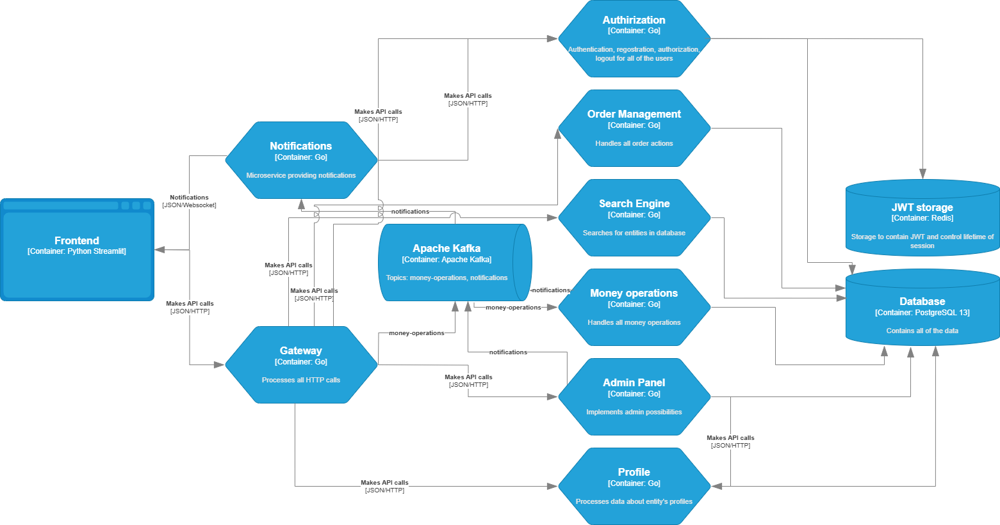

# albums

Simple web application to "buy"/explore music albums. Built for educational purposes only. Uses Redis, PostgreSQL, Apache Kafka.

## Build

### Config

```shell
cp .env.example .env
```

### Backend
```shell
make # build and run
make build
make run
make down # close the application
```

### Frontend
```shell
pip3 install -r requirements.txt
streamlit run web/main.py
```

## Architecture
